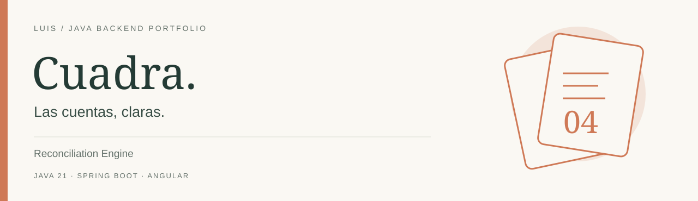
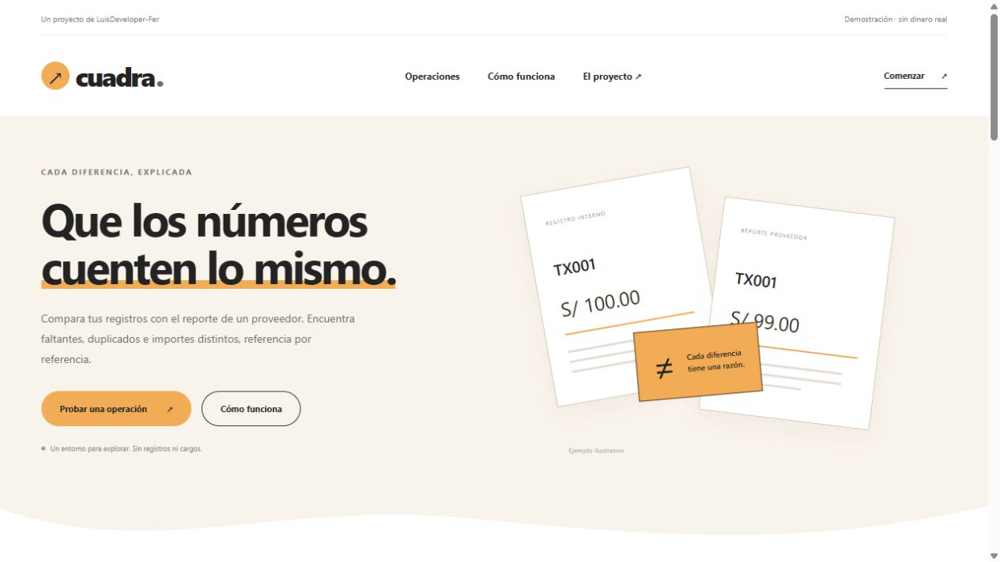
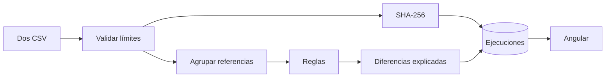

[](https://github.com/LuisDeveloper-Fer/reconciliation-engine/actions/workflows/ci.yml)


[](LICENSE)

**El registro interno y el reporte de un proveedor pueden discrepar. El motor compara ambos y explica las diferencias, sin redondear importes ni elegir qué sistema tiene razón.**

Proyecto independiente del [Backend Systems Lab de Luis](https://github.com/LuisDeveloper-Fer). Código y datos de demostración, sin información propietaria ni dinero real.

## En 60 segundos

- BigDecimal y moneda explícita
- Reglas de duplicados, faltantes, importe y moneda
- SHA-256 del par de reportes para idempotencia
- Resultados persistidos y explicaciones deterministas
- Lotes acotados: 1000 filas por reporte

**Experimento principal:** Carga los ejemplos del panel: hay un importe distinto y referencias ausentes. Repite el mismo lote y obtendrás el mismo ID.

## Vista previa



Interfaz con formularios de operación, estado consultable y detalle técnico desplegable. La imagen muestra la portada; para ejecutar el flujo completo sigue las instrucciones de abajo.

## Ejecutar

Requisitos: **JDK 21**, Maven 3.9+, Node 22.12+ para Angular y Docker Compose para el stack completo. [Compatibilidad de Spring Boot](https://docs.spring.io/spring-boot/system-requirements.html) · [Compatibilidad de Angular](https://angular.dev/reference/versions).

```bash
git clone https://github.com/LuisDeveloper-Fer/reconciliation-engine.git
cd reconciliation-engine
mvn clean package
docker compose up --build
```

| Componente | Dirección |
| --- | --- |
| Angular | http://localhost:4200 |
| API | http://localhost:8080 |

Puertos publicados solo en loopback. Ejecuta un laboratorio a la vez o cambia API_PORT/UI_PORT en el entorno.

### Desarrollo local

```bash
mvn spring-boot:run
# otra terminal:
cd frontend
npm ci
npm start
```

Localmente usa H2 en memoria para arrancar y probar sin dependencias. **Compose usa PostgreSQL 17 con volumen persistente**. Configura DB_URL, DB_USER y DB_PASSWORD para otro datasource. Hibernate ddl-auto=update simplifica el laboratorio; producción requiere migraciones versionadas.

## Arquitectura



Los duplicados tienen prioridad porque vuelven ambiguo el emparejamiento. Se compara moneda antes que importe. Una diferencia es evidencia para revisión, no autorización para corregir un balance. Un algoritmo de agrupación acotado evita introducir un motor de reglas genérico.

[Decisión técnica](docs/adr/001-design.md) · [Contrato de API](docs/api.md) · [Guion de entrevista](docs/interview.md)

## Primer request

```bash
curl -i -X POST http://localhost:8080/api/reconciliations \
  -H 'Content-Type: application/json' \
  --data '{"internalCsv":"reference,amount,currency\nTX001,100.00,PEN\nTX002,50.00,USD","providerCsv":"reference,amount,currency\nTX001,99.00,PEN\nTX003,50.00,USD"}'
```

Ejemplo de respuesta, campos relevantes:

```json
{
  "id": "sha256-de-los-reportes",
  "internalRows": 2,
  "providerRows": 2,
  "discrepancyCount": 3,
  "reportJson": "[{\"reference\":\"TX001\",\"rule\":\"AMOUNT_MISMATCH\",\"explanation\":\"Internal=100.00, provider=99.00\"}]"
}
```

IDs y fechas cambian en cada ejecución. [Colección curl](examples/requests.sh) · [Payload JSON](examples/request.json).

## Endpoints

| Método | Ruta | Resultado |
| --- | --- | --- |
| POST | `/api/reconciliations` | 200 ejecución nueva/existente; 400 CSV inválido |
| GET | `/api/reconciliations/{id}` | Resultado persistido |
| GET | `/api/reconciliations` | Últimas 20 ejecuciones |

## Pruebas

```bash
mvn clean package
cd frontend && npm ci && npm run build
```

Cinco clases de diferencia, igualdad decimal independiente de escala y CSV malformado. Las pruebas no necesitan Docker y usan H2; no sustituyen una validación sobre PostgreSQL. CI compila Java y Angular. [Evidencia y límites de validación](docs/VALIDATION.md).

## Estructura

```text
src/main/java/dev/portfolio/
  api/              Contratos HTTP y validación
  application/      Casos de uso
  domain/           Estado y reglas
  infrastructure/   Clientes o repositorios
src/test/           Pruebas
frontend/           Angular standalone
ops/                Entorno de ejecución
docs/               Decisiones y guía técnica
examples/           Requests reproducibles
```

## Alcance honesto

CSV deliberadamente limitado: reference,amount,currency, sin comillas ni escapes. Máximo 1000 filas y 200000 caracteres por reporte. El orden/formato cambia el hash: la deduplicación es por contenido exacto, no semántica. No corrige operaciones ni convierte monedas.

API de laboratorio sin autenticación, enlazada localmente. [secure-api-demo](https://github.com/LuisDeveloper-Fer/secure-api-demo) aborda seguridad por separado.

## Para una entrevista

1. Reproduce el experimento principal y explica el resultado.
2. Identifica dónde termina cada transacción y qué garantiza.
3. Explica qué ocurre ante un reinicio o una solicitud duplicada.
4. Justifica qué cambiarías para operar varias instancias.

---

**LuisDeveloper-Fer** · Java Backend Developer · [Los seis laboratorios](https://github.com/LuisDeveloper-Fer) · [MIT](LICENSE)
